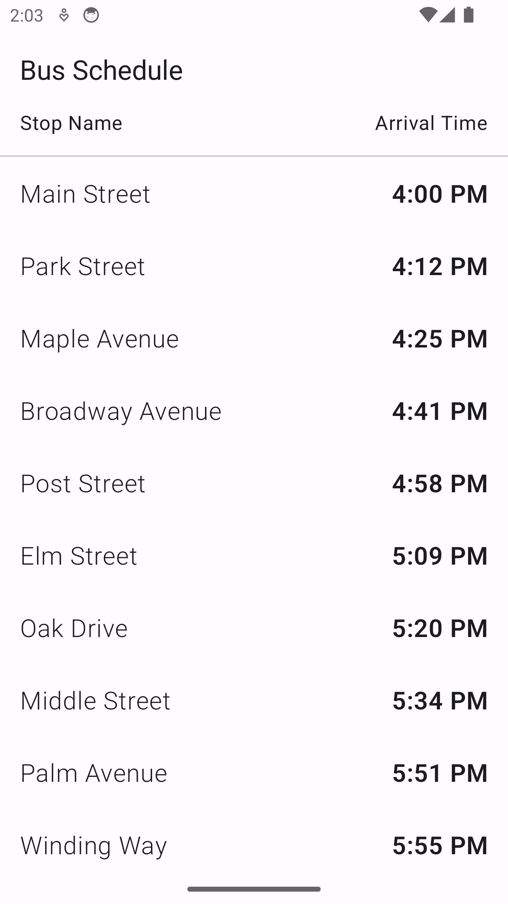

# Bus Schedule App

Ejercicio practico sobre la implementacion de una Room en Kotlin para tener persistencia de datos.

Esto es un Code Lab para la asignatura de PAMN(Programacion de Aplicaciones Moviles Nativas). 

### Por César José Delgado Suárez

